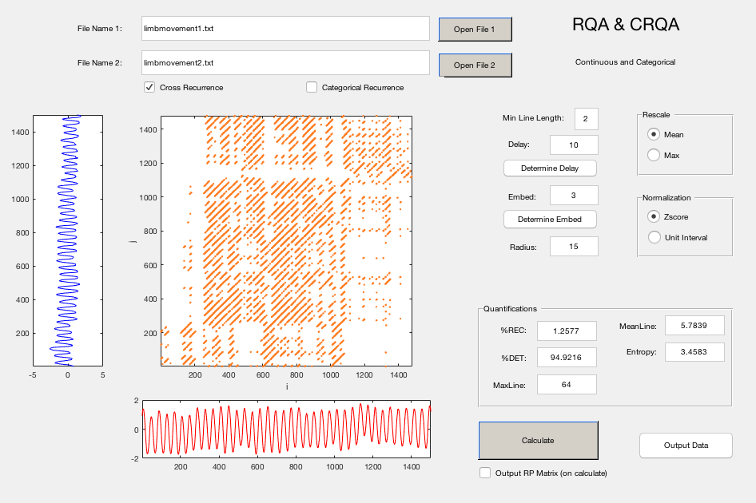

# RQA-and-CRQA-GUI-Application
A Continuous and Categorical Data Analysis Tool

GUI Application Compiled By: Michael Richardson using MATLAB guide toolbox.

Code Developed and Adapted with/from numerous people over the years,  including (but not limited to):
- Michael Richardson, University of Macquarie (and while @ University of Cincinnati)
- Kevin Shockley: University of Cincinnati
- Rick Dale: UCLA (and while @ UC Merced)
- Jay Holden, University of Cincinnati
- Mike Riley: University of Cincinnati
- Bruce Kay: University of Connecticut
- Steven Boker: University of Virginia
- Charles Coey, Harvard Medical School (and while @ University of Cincinnati

## Disclaimer
The software is provided "as is", without warranty of any kind, express or implied, including but not limited to the warranties of merchantability, fitness for a particular purpose and non-infringement. In no event shall the authors or copyright holders be held liable for any claim, damages or other liability, whether in an action of contract, tort or otherwise, arising from, out of or in connection with the software or the use or other dealings in the software.

## Compiled Applications 
The compiled PC GUI application can be used as a standalone application. The GUI was compiled using MATALB, but does not require MATLAB. However, in order to use the compiled/executable application you will need to install the free MATLAB Runtime Component Compiler.
- PC: 2017b MATLAB Runtime Component Compiler 64-bit.

Use the included web installer or directly download the corresponding free runtime compiler from Mathworks.com: http://www.mathworks.com/products/compiler/mcr/?refresh=true

## Uncompiled MATLAB Files
If you have MATLAB you can run the GUI directly from MATLAB using the included m-files (i.e., you don’t need to install the runtime component compiler). The following files are included:
- rqa: This GUI script calculates the auto- and/or cross-recurrence measures (e.g., %recurrence, %determinism, entropy, maxline) for categorical or continuous time series data. The calculated statistics can be output to a summary ‘.csv’ file. You can run computations on multiple input files by selecting the Batch option and creating a batch file (see examples batch files). The RP matrix can also be saved for further quantification or for joint-recurrence calculations.

- ami: This GUI script calculates the average mutual information (in bits)—the amount of information that is shared between data points in a time series separated by a given number of data points. After selecting the file to be analyzed (a single column of ASCII data), the output is a graph of AMI as a function of delay. A common convention is to use the first local minimum in the AMI plot.

- fnn: The GUI script calculates the percent of data points that were determined false neighbors when the time series was embedded in a higher number of dimensions. After the selecting file to be analyzed (a single column of ASCII data), you will be asked to provide the delay (e.g., the delay selected based on your AMI function), and the number of embedding dimensions. You could start at 20 embedding dimensions and work your way down. Note that the calculations depend on the delay selected and the number of embedding dimensions used. Therefore, the values may not be identical for a given data set given a different number of embedding dimensions. Output is a graph of % false neighbors as a function of embedding dimension. Code adapted from code by Steven Boker (University of Virginia) and Bruce Kay (University of Connecticut)

## Selected RQA and CRQA Related References:
- Boker, S. M. & Wenger, M. J. (2007) data analytic techniques for dynamical systems in the social and behavioral sciences. Mahwah, NJ: Lawrence Erlbaum Associates.
- Dale, R., & Spivey, M. J. (2005). Categorical recurrence analysis of child language. Proceedings of the 27th Annual Meeting of the Cognitive Science Society. 530–535.
- Dale, R., & Spivey, M. J. (2006). Unraveling the dyad: Using recurrence analysis to explore patterns of syntactic coordination between children and caregivers in conversation. Language Learning, 56, 391-430.
- Marwan, N. (2008). A historical review of recurrence plots. European Physical Journal, 164, 3–12.
- Marwan, N., & Meinke, A. (2002). Extended recurrence plot analysis and its application to ERP data. International Journal of Bifurcation and Chaos, 14, 761-771.
- Richardson, D.C., Dale, R., & Spivey, M. J. (2007). Eye movements in language and cognition. In M. Gonzalez-Marquez, I. Mittelberg, S. Coulson, & M. J. Spivey (Eds.), Methods in Cognitive Linguistics (pp. 328–341). Amsterdam/Philadelphia: John Benjamins.
- Richardson, M. J. Dale R., & Marsh, K. L., (2014). Complex Dynamical Systems in Social and Personality Psychology: Theory, Modeling and Analysis. In H. T. Reis, and C. M. Judd. (Eds.). Handbook of Research Methods in Social and Personality Psychology, 2nd Edition. New York, NY: Cambridge University Press.
- Richardson, M. J., Schmidt, R. C., & Kay, B. A. (2007) Distinguishing the noise and attractor strength of coordinated limb movements using recurrence analysis. Biological Cybernetics, 96, 59-78.
- Riley, M. A., Balasubramaniam, R., Turvey, M. T. (1999) Recurrence quantification analysis of postural fluctuations. Gait & Posture, 9, 65–78.
- Shockley, K., Santana, M. V., & Fowler, C. A. (2003). Mutual interpersonal postural constraints are involved in cooperative conversation. Journal of Experimental Psychology: Human Perception and Performance, 29, 326-332.
- Webber, C. L., Jr. & Zbilut, J. P. (2005). Recurrence quantification analysis of nonlinear dynamical systems. In M. A. Riley & G. C. Van Orden (Eds.), Contemporary nonlinear methods for behavioral scientists: A webbook tutorial (pp. 26–94).  Retrieved April 8, 2005, from http://www.nsf.gov/sbe/bcs/pac/nmbs/nmbs.jsp
- Zbilut, J. P., Thomasson, N., & Webber, C. L. (2002). Recurrence quantification analysis as a tool for nonlinear exploration of nonstationary cardiac signals. Medical Engineering & Physics, 24, 53-60. 
